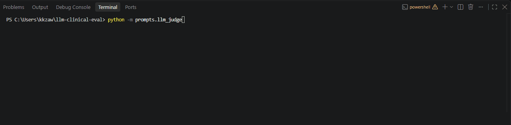

# LLM Clinical Eval Framework

A configurable, rubric-driven framework for evaluating LLM-generated clinical recommendations. The scoring rubric is treated as **data**, not hardcoded logic — any structured clinical rubric can be loaded and used to score any clinical response, with no changes to the underlying engine.

## Motivation

This project grew out of a real research workflow: manually running multiple LLMs against clinical cases and scoring their outputs against a rubric reviewed by a team of pharmacists. That process worked, but was entirely manual — spreadsheets, hand-scoring, and no reusable tooling.

This framework automates that same idea end-to-end: a clinical case goes in, an LLM generates a recommendation, and a second LLM scores that recommendation against a structured rubric — producing consistent, reproducible, itemized results (plus flagged safety concerns) instead of ad hoc manual review.

## How it works

The pipeline runs in five stages:

1. **Structured input collection** — either a person is prompted field-by-field for case details (chief complaint, PMH, PSH, medications, clinical findings, allergies, labs, vitals), or a batch of pre-written cases is loaded from a JSON file.
2. **Case formatting** — an LLM, acting as an attending physician, reformats the raw fields into a single, flowing clinical presentation, the way one physician would hand off a case to another.
3. **Consultant response generation** — a second LLM call produces a structured clinical recommendation following a fixed alphanumeric outline (chief complaint, comorbidities, dosing, safety, communication, follow-up), ending with a short standalone clinical summary suitable for a physician handoff.
4. **Rubric-based judging** — a third LLM call scores the recommendation item-by-item against a YAML-defined rubric (0, 1, or 2 per item), and separately assesses whether the response exhibits any flagged issues (critical errors, unsupported claims, scope violations, major omissions) — since a response can score well numerically while still containing something dangerous.
5. **Scoring and logging** — parsed scores are summed against the rubric's total, and the full record (raw case, formatted case, response, summary, scores, flags, model, rubric version) is appended to a JSONL log for later review or RL training.

All LLM calls share a consistent "attending physician" persona (set via the API's `system` parameter); each call's task-specific instructions live in its own prompt-building function.

## Project structure

```
llm-clinical-eval/
├── rubric/
│   └── example_rubric.yaml        # Generic, domain-agnostic scoring rubric
├── batch/
│   └── sample_cases.json          # Example pre-written cases for batch mode
├── data/
│   └── data_logs.jsonl            # Logged results (case, response, scores, flags)
├── objects.py                      # Rubric / Domain / Item dataclasses + YAML loader
├── call_API.py                     # Shared Anthropic API wrapper (call_claude) + persona/model constants
├── case_input.py                   # Interactive field collection + raw-case-to-text assembly
├── data_logger.py                  # Appends a completed run's data to the JSONL log
├── automate_pipeline.py            # Orchestrates a full run for one case, or a batch of cases
├── view_logs.py                    # Human-readable viewer for data_logs.jsonl
├── prompts/
│   ├── llm_HPI.py                  # Reformats raw input into a clinical presentation
│   ├── llm_consultant.py           # Generates clinical recommendations + summary
│   └── llm_judge.py                # Scores a response against the rubric, detects flags
├── .env                             # API key (not committed)
├── .gitignore
└── README.md
```

## Usage

```
pip install pyyaml python-dotenv anthropic --break-system-packages
```
Create a `.env` file with `ANTHROPIC_API_KEY=your-key-here`, then run:
```
python automate_pipeline.py
```
You'll be asked to choose **"one case"** (interactive, field-by-field input, prints a summary at the end) or **"batches"** (reads `batch/sample_cases.json`, runs every case unattended, printing progress as each one finishes). Either mode logs full results to `data/data_logs.jsonl`.

To review logged results in a readable format:
```
python view_logs.py
```

## The rubric

Rubrics are defined as YAML — any rubric following this shape can be dropped in without touching the scoring engine:

```yaml
rubric_name: "Clinical Reasoning Validation"
total_points: 42
domains:
  - name: "Clinical Decision Making and CC Prioritization"
    max_points: 10
    items:
      - id: "A-1"
        topic: "Individualized chief complaint stated"
        criteria:
          0: "No individualized chief complaint stated"
          1: "Chief complaint stated, but vague"
          2: "Chief complaint is stated clearly and uses proper terminology"
flags:
  - name: "Critical Errors"
    description: "Any critical errors that could result in patient harm"
    reported_separately: true
```

The included `example_rubric.yaml` is a generalized, condition-agnostic version of a rubric originally developed and reviewed for a diabetes-specific research project — restructured here to score clinical reasoning across any presenting condition.

## Batch cases format

`batch/sample_cases.json` holds a JSON array of raw case dicts, using the same field labels the interactive collector produces:
```json
[
  {
    "Chief Complaint: ": "...",
    "PMH: ": "...",
    "PSH: ": "...",
    "Current Medications: ": "...",
    "Pertinent clinical findings: ": "...",
    "Allergies: ": "...",
    "Labs: ": "...",
    "Vitals: ": "..."
  }
]
```

## Design notes / known limitations

- **Scoring assumes equal item weighting.** `calculate_total` sums raw item scores; the rubric schema doesn't currently support per-item point weighting.
- **The judge's JSON output is defensively parsed**, since LLMs occasionally wrap JSON in markdown code fences despite explicit instructions not to.
- **Flags were validated against a deliberately flawed mock response** (continuing a medication contraindicated at the patient's actual renal function) — the judge correctly raised "Critical Errors" and "Major Omission" and dropped the item score sharply, while a strong response correctly raised no flags.
- **The case-formatting step (`llm_HPI.py`) has some hallucination risk** for fields reported as absent — the prompt explicitly prohibits inferring a status (e.g., "not yet performed") that wasn't stated, but this is worth continued monitoring.
- **Judge reliability was validated manually**, not statistically: known-weak, known-strong, and middling mock responses produced correctly discriminating scores across items, not uniform results.

## Roadmap

- **Manual scoring path** — allow a human to score the same response independently, to compute inter-rater agreement (e.g., weighted kappa) between the LLM judge and a human reviewer.
- **Multi-model comparison** — extend `call_claude` (or add sibling functions) to compare recommendations across multiple LLM providers, echoing the original manual research process this project automates.
- **Source-grounded consultant (RAG)** — retrieval over clinical guidelines/literature (e.g., PubMed) so consultant recommendations are grounded in retrievable, citable sources.
- **Patient-facing mode** — a separate, clearly-disclaimed educational mode where a patient can input their own diagnosis/summary and receive an explanation with explorable sources, distinct from the clinician-facing consultant mode. This mode is explicitly **not** intended to provide medical advice or diagnosis.

## Tech stack

Python, PyYAML, python-dotenv, Anthropic API (Claude Haiku 4.5)

## Demo

